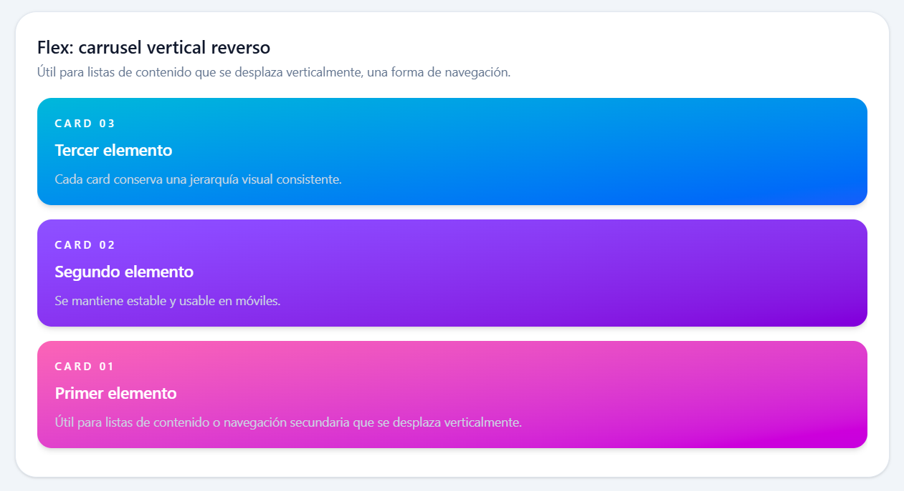
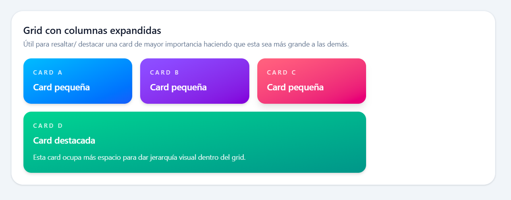
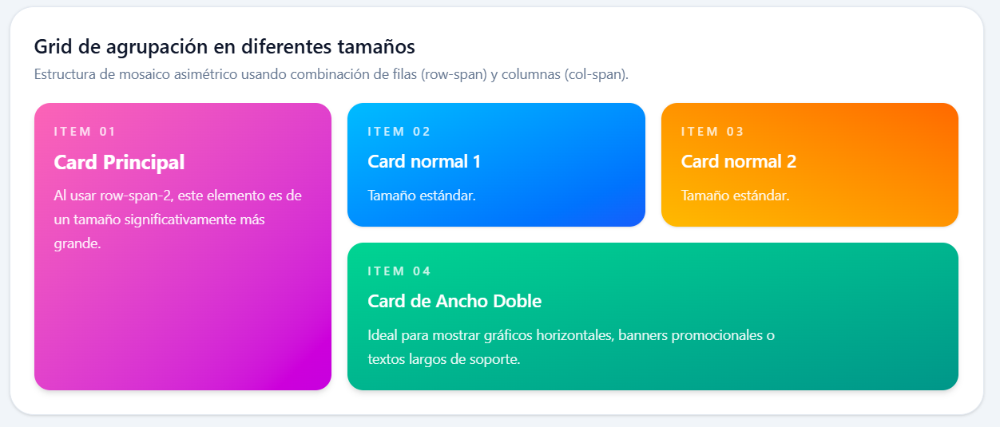
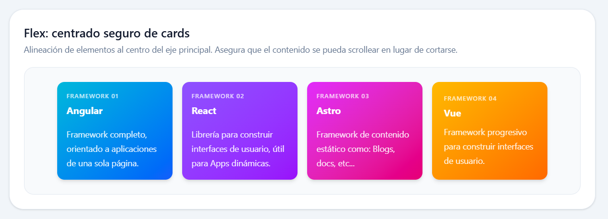
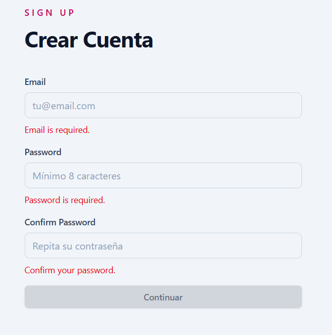
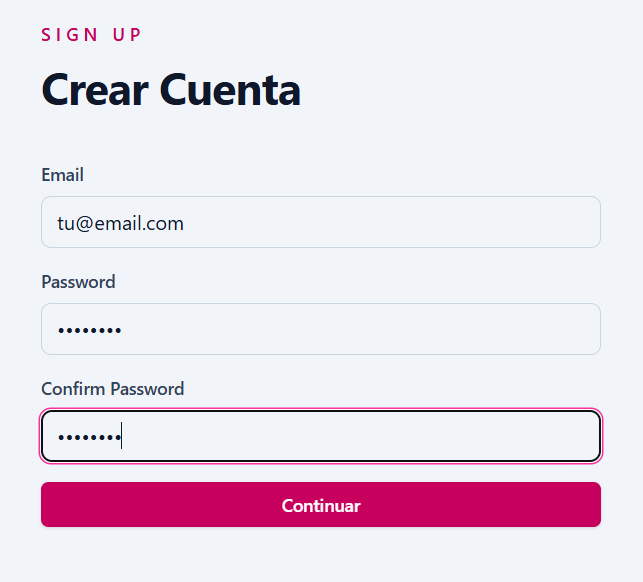
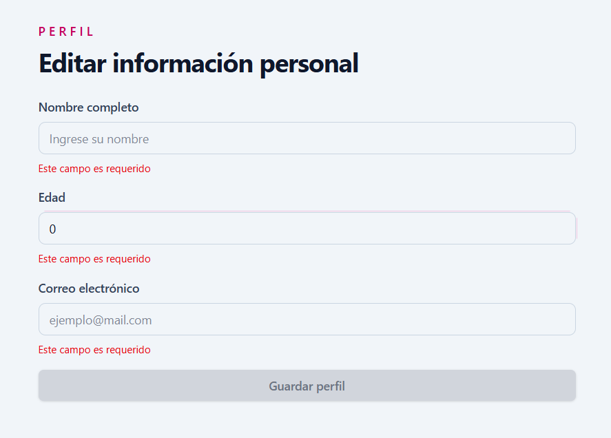
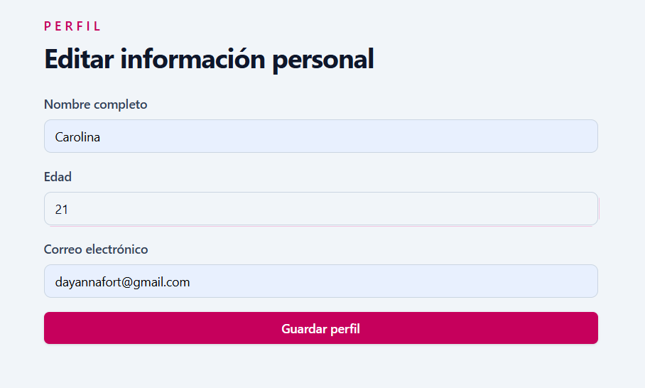
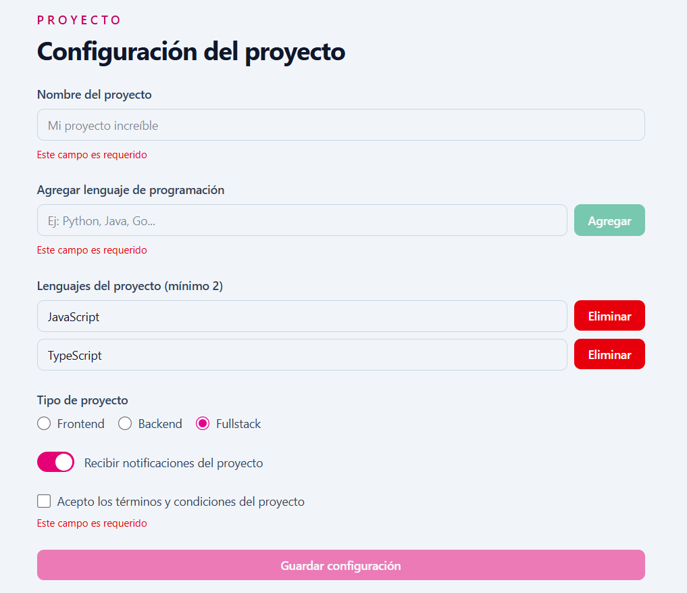
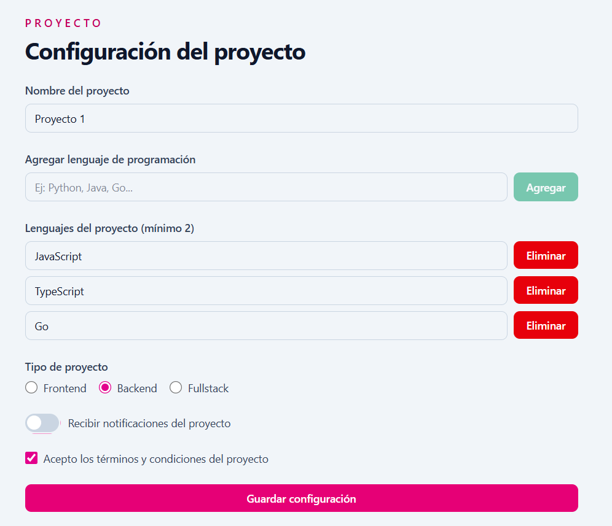

# Práctica Angular 04 - Layouts con Tailwind

### Carolina Fortmann

-----------------

Realizar cuatro distribuciones adicionales en ```layouts-page.html``` tomadas de la documentación oficial de Tailwind:

#### 1. Layout con ```flex-col-reverse```:


**Descripción:** Se implementa un contenedor flexible que organiza sus elementos en una columna vertical, pero invirtiendo el orden del flujo de los elementos (`flex-direction: column-reverse`). Esto hace que el primer elemento del código se renderice en la parte inferior y el último en la parte superior, ideal para secciones de chats, feeds de actividad o componentes que requieran un orden invertido en dispositivos móviles.


#### 2. Layout con ```grid gap-4```:


**Descripción:** Se utiliza un Grid para alinear elementos en filas y columnas estructuradas de forma simétrica. La propiedad `gap-4` aplica una separación uniforme de `1rem` (16px) tanto horizontal como verticalmente entre las celdas de la rejilla.

#### 3. Layout con ```row-span``` y ```col-span```:


**Descripción:** Permite que ciertos elementos utilicen múltiples celdas. Utilizando clases como `row-span` y `col-span`, define cuántas filas y columnas debe ocupar un elemento específico respectivamente. Esto facilita el diseño de distribuciones asimétricas complejas, como galerías de imágenes o layouts de periódicos.

#### 4. Layout con ```flex-wrap justify-center-safe```:


**Descripción:** Es un layout dinámico y adaptable. La clase `flex-wrap` permite que las tarjetas o elementos pasen automáticamente a la siguiente línea si se quedan sin espacio en la fila actual, evitando el desbordamiento horizontal. Por otra parte, la variable `justify-center-safe` alinea los elementos al centro del contenedor y activa un mecanismo de seguridad para que en caso de usar pantallas pequeñas, el contenido mantenga sus márgenes izquierdos legibles en lugar de recortarse fuera de los límites de esta.

------
# Práctica Angular 05 - Formularios Reactivos

Capturas de las prácticas:

#### Práctica A: Formularios simples ```sign-up```





#### Práctica B: Rutilización de código ```FormUtils```





#### Práctica C: Formularios complejos ```dinámicos + especiales```




